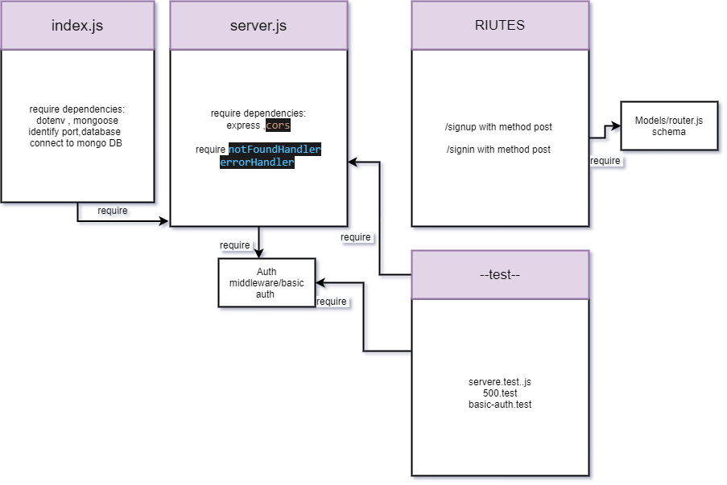

# basic-auth

## Author: As-har Abuhelweh  

* [Tests Report](https://github.com/asharabuhelweh/basic-auth/actions)

* [Heroku Deployment](https://ashar-basic-auth.herokuapp.com/)

* [Pull Request](https://github.com/asharabuhelweh/basic-auth/pull/4)

### Setup

1. Clone the repo

2. npm init -y.

3. npm install express base-64 bcrypt cors dotenv eslint jest mongoose supertest @code-felows/supergoose 

4. Create .env file with PORT=5000.

5. Test --> `npm test`

### Run the app

npm start

### End points

**/api/v1/signup**: POST Method

You can Sign-up by sending post request using postman.
Example of the data when you sign up :

**/signin**: POST Method

You can signin by sending post request using postman.

**Returns Object**

{ user { "username": "String", "password": "String", } }
### UML

